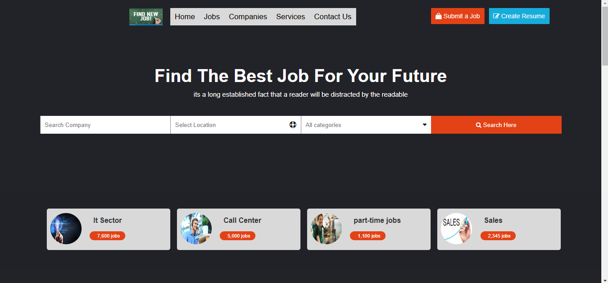
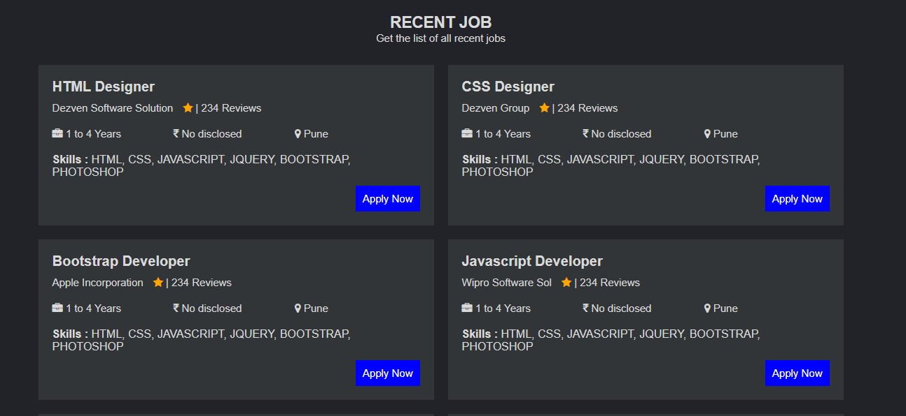
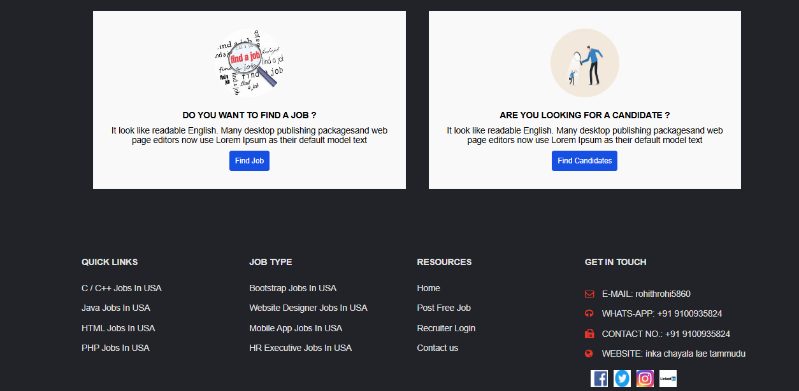

<h1>
  Job-Searching-website
</h1>
<h3>
  summary 
</h3>

  This job-searching website, crafted using HTML and CSS, provides a straightforward and visually appealing platform for job seekers and employers. It includes dedicated sections for browsing job listings, applying for positions, and creating personalized user profiles. The website’s design focuses on simplicity and ease of navigation, ensuring a seamless user experience. Job seekers can filter job listings based on their preferences, while employers can post openings and manage applications. The responsive layout ensures compatibility with various devices, making it accessible for users on mobile, tablet, and desktop devices.

<h4>
  Header 
</h4>

  The header show the home,jobs,company and service's.There is a search of the company,location.The page show the job openings in the different sectors.

<h4>
  Recent job section
</h4>

  The rececent job section show the  on which domain the job openings are open and the skills required to the job.

<h4>
  last page
</h4>

  The last page of the website show the user about to find the job or candidate.The footer section show's the other details of the website.

